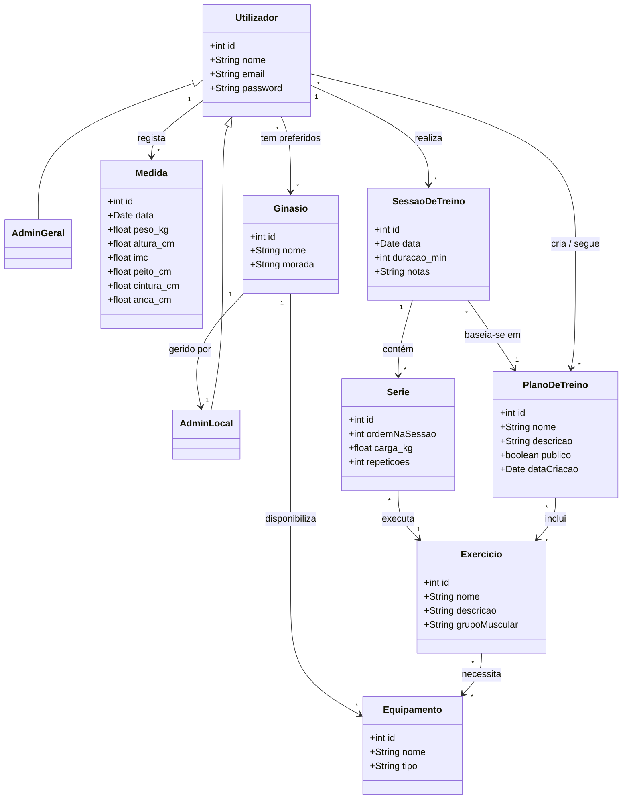

# Modelo de Domínio — MyBodyFitness

## Diagrama de Classes

## Descrição das Entidades

| Entidade | Descrição |
|---|---|
| **Utilizador** | Pessoa registada na aplicação. Pode criar planos, registar treinos e acompanhar a sua progressão. |
| **AdminLocal** | Utilizador com permissões de gestão de um ginásio específico (equipamentos disponíveis). |
| **AdminGeral** | Utilizador com permissões globais de manutenção da plataforma. |
| **Medida** | Registo periódico das medidas corporais e peso de um utilizador. |
| **PlanoDeTreino** | Conjunto ordenado de exercícios planeados. Pode ser público (partilhável) ou privado. |
| **SessaoDeTreino** | Realização efetiva de um treino numa data concreta, com base num plano. |
| **Serie** | Execução de um exercício com uma carga e número de repetições numa sessão. |
| **Exercicio** | Movimento específico com grupo muscular alvo e equipamento necessário. |
| **Equipamento** | Material ou máquina necessário para realizar um exercício. |
| **Ginasio** | Instalação desportiva com equipamentos disponíveis, gerida por um AdminLocal. |
