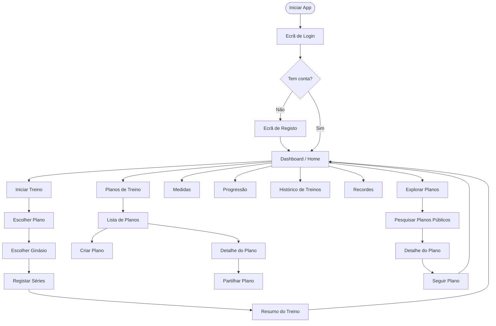

# Protótipo — MyBodyFitness

## Fluxo de Navegação



---

## Ecrãs

### 1. Login

```
┌─────────────────────────────┐
│                             │
│       MyBodyFitness         │
│          💪 Logo            │
│                             │
│  ┌───────────────────────┐  │
│  │  Email                │  │
│  └───────────────────────┘  │
│  ┌───────────────────────┐  │
│  │  Password             │  │
│  └───────────────────────┘  │
│                             │
│  ┌───────────────────────┐  │
│  │       ENTRAR          │  │
│  └───────────────────────┘  │
│                             │
│    Não tens conta?          │
│    [ Registar ]             │
│                             │
└─────────────────────────────┘
```

---

### 2. Registo

```
┌─────────────────────────────┐
│  ←  Criar Conta             │
├─────────────────────────────┤
│  ┌───────────────────────┐  │
│  │  Nome completo        │  │
│  └───────────────────────┘  │
│  ┌───────────────────────┐  │
│  │  Email                │  │
│  └───────────────────────┘  │
│  ┌───────────────────────┐  │
│  │  Password             │  │
│  └───────────────────────┘  │
│  ┌───────────────────────┐  │
│  │  Confirmar Password   │  │
│  └───────────────────────┘  │
│                             │
│  ┌───────────────────────┐  │
│  │      REGISTAR         │  │
│  └───────────────────────┘  │
└─────────────────────────────┘
```

---

### 3. Dashboard / Home

```
┌─────────────────────────────┐
│  Olá, Tomás 👋       ⚙️    │
├─────────────────────────────┤
│                             │
│  ┌───────────────────────┐  │
│  │  ▶  INICIAR TREINO    │  │
│  └───────────────────────┘  │
│                             │
│  Último treino: há 2 dias   │
│  Treinos este mês: 8        │
│                             │
├─────────────────────────────┤
│  Acesso Rápido              │
│                             │
│  ┌──────────┐ ┌──────────┐  │
│  │  Planos  │ │ Medidas  │  │
│  └──────────┘ └──────────┘  │
│  ┌──────────┐ ┌──────────┐  │
│  │Histórico │ │Recordes  │  │
│  └──────────┘ └──────────┘  │
│                             │
│  ┌───────────────────────┐  │
│  │   Explorar Planos     │  │
│  └───────────────────────┘  │
│                             │
└─────────────────────────────┘
```

---

### 4. Iniciar Treino — Escolher Plano e Ginásio

```
┌─────────────────────────────┐
│  ←  Iniciar Treino          │
├─────────────────────────────┤
│  Escolhe o plano:           │
│                             │
│  ◉  Push Day                │
│  ○  Pull Day                │
│  ○  Leg Day                 │
│  ○  Full Body               │
│                             │
├─────────────────────────────┤
│  Escolhe o ginásio:         │
│                             │
│  ◉  Fitness Hut (preferido) │
│  ○  Solinca                 │
│  ○  + Adicionar ginásio     │
│                             │
│  ┌───────────────────────┐  │
│  │     COMEÇAR ▶         │  │
│  └───────────────────────┘  │
└─────────────────────────────┘
```

---

### 5. Registar Treino — Séries

```
┌─────────────────────────────┐
│  ←  Push Day  •  Fitness Hut│
│  ⏱ 00:24:13                 │
├─────────────────────────────┤
│  Supino Plano  (Peito)      │
│                             │
│  Série  Carga(kg)  Reps  ✓  │
│  ─────  ─────────  ────  ─  │
│    1      80         10   ✓ │
│    2      80          8   ✓ │
│    3    [  ]        [  ]  + │
│                             │
│  [ + Adicionar série ]      │
│                             │
├─────────────────────────────┤
│  ▼  Próximo: Crucifixo      │
│  ▼  Tríceps Corda           │
│  ▼  Ombros Press            │
├─────────────────────────────┤
│  ┌───────────────────────┐  │
│  │   TERMINAR TREINO ■   │  │
│  └───────────────────────┘  │
└─────────────────────────────┘
```

---

### 6. Resumo do Treino

```
┌─────────────────────────────┐
│       Treino Concluído! 🎉  │
├─────────────────────────────┤
│  Data:     15 Abr 2026      │
│  Duração:  01:02:34         │
│  Ginásio:  Fitness Hut      │
│  Plano:    Push Day         │
├─────────────────────────────┤
│  Exercício       Séries Vol.│
│  ─────────────── ────── ────│
│  Supino Plano      3   2040 │
│  Crucifixo         3    720 │
│  Tríceps Corda     4    960 │
│  Ombros Press      3   1260 │
├─────────────────────────────┤
│  Volume total: 4.980 kg     │
│                             │
│  ┌───────────────────────┐  │
│  │      IR PARA HOME     │  │
│  └───────────────────────┘  │
└─────────────────────────────┘
```

---

### 7. Planos de Treino

```
┌─────────────────────────────┐
│  Planos de Treino    [ + ]  │
├─────────────────────────────┤
│  Os meus planos             │
│                             │
│  ┌───────────────────────┐  │
│  │  Push Day      🔒  >  │  │
│  │  4 exercícios         │  │
│  └───────────────────────┘  │
│  ┌───────────────────────┐  │
│  │  Pull Day      🌐  >  │  │
│  │  5 exercícios         │  │
│  └───────────────────────┘  │
│  ┌───────────────────────┐  │
│  │  Leg Day       🔒  >  │  │
│  │  5 exercícios         │  │
│  └───────────────────────┘  │
│                             │
│  Planos que sigo            │
│                             │
│  ┌───────────────────────┐  │
│  │  Full Body PPL   by @ │  │
│  │  rodolopes • 6 ex.  > │  │
│  └───────────────────────┘  │
└─────────────────────────────┘
```

---

### 8. Criar Plano de Treino

```
┌─────────────────────────────┐
│  ←  Novo Plano              │
├─────────────────────────────┤
│  ┌───────────────────────┐  │
│  │  Nome do plano        │  │
│  └───────────────────────┘  │
│  ┌───────────────────────┐  │
│  │  Descrição (opcional) │  │
│  └───────────────────────┘  │
│                             │
│  Visibilidade:              │
│  ◉ Privado  ○ Público       │
│                             │
├─────────────────────────────┤
│  Exercícios                 │
│                             │
│  1. Supino Plano    ✕       │
│     Peito • Barra           │
│  2. Crucifixo       ✕       │
│     Peito • Halteres        │
│                             │
│  [ + Adicionar exercício ]  │
│                             │
│  ┌───────────────────────┐  │
│  │      GUARDAR          │  │
│  └───────────────────────┘  │
└─────────────────────────────┘
```

---

### 9. Registar Medidas

```
┌─────────────────────────────┐
│  ←  Registar Medidas        │
├─────────────────────────────┤
│  Data: 15/04/2026  (hoje)   │
│                             │
│  Peso (kg)                  │
│  ┌───────────────────────┐  │
│  │  78,5                 │  │
│  └───────────────────────┘  │
│  Altura (cm)                │
│  ┌───────────────────────┐  │
│  │  178                  │  │
│  └───────────────────────┘  │
│  IMC calculado: 24,8  ✅    │
│                             │
│  Medidas corporais          │
│  Peito: [ ___ ] cm          │
│  Cintura: [ ___ ] cm        │
│  Anca: [ ___ ] cm           │
│                             │
│  ┌───────────────────────┐  │
│  │      GUARDAR          │  │
│  └───────────────────────┘  │
└─────────────────────────────┘
```

---

### 10. Progressão (Gráfico)

```
┌─────────────────────────────┐
│  ←  Progressão              │
├─────────────────────────────┤
│  [ Peso ][ IMC ][ Medidas ] │
├─────────────────────────────┤
│  Peso (kg)                  │
│                             │
│  82 ┤                       │
│  80 ┤  ●                    │
│  78 ┤    ●   ●              │
│  76 ┤          ●   ●        │
│  74 ┤                  ●    │
│     └──────────────────     │
│     Jan Fev Mar Abr Mai     │
│                             │
├─────────────────────────────┤
│  [ 1M ][ 3M ][ 6M ][ 1A ]  │
│                             │
│  Início: 82,0 kg            │
│  Atual:  76,5 kg            │
│  Diferença: -5,5 kg ↓       │
└─────────────────────────────┘
```

---

### 11. Recordes

```
┌─────────────────────────────┐
│  Recordes (1RM)             │
├─────────────────────────────┤
│  Exercício      Máx.  Data  │
│  ──────────────────────────│
│  Supino Plano  100kg  Mar   │
│  Agachamento   120kg  Abr   │
│  Peso Morto    140kg  Abr   │
│  Curl Bíceps    28kg  Fev   │
│  Press Ombros   60kg  Mar   │
├─────────────────────────────┤
│  Supino Plano — Evolução    │
│                             │
│  100┤             ●         │
│   90┤      ●   ●            │
│   80┤  ●                    │
│     └──────────────────     │
│     Jan Fev Mar Abr         │
└─────────────────────────────┘
```

---

### 12. Explorar Planos Públicos

```
┌─────────────────────────────┐
│  Explorar Planos     🔍     │
├─────────────────────────────┤
│  ┌───────────────────────┐  │
│  │  🔍 Pesquisar plano   │  │
│  └───────────────────────┘  │
│  Filtrar: [Peito][Costas]   │
│           [Pernas][Tudo]    │
├─────────────────────────────┤
│  ┌───────────────────────┐  │
│  │  Full Body PPL        │  │
│  │  @rodolopes • 6 ex.   │  │
│  │  ⭐ 4.8 • 120 seguid.  │  │
│  │  [ + Seguir ]         │  │
│  └───────────────────────┘  │
│  ┌───────────────────────┐  │
│  │  Push Hypertrophy     │  │
│  │  @luispamp • 5 ex.    │  │
│  │  ⭐ 4.5 • 87 seguid.   │  │
│  │  [ + Seguir ]         │  │
│  └───────────────────────┘  │
└─────────────────────────────┘
```
